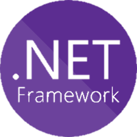
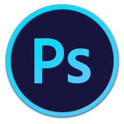

# Hi there, I'm Adriana! 👋
I'm a Computer Science student, passionate about UX/UI Design, Photography and Photo editing. I'm a a curious person who likes to explore different programming languages. My favorite programming language is C (C++, C#). Also, I like to create the interface of mobile applications.
    
   :hibiscus: Fun fact: I am passionate about Korean culture.:hibiscus:

<!-- -->

# You can find me on:

# Technologies used:

<!-- -->

     
# Stats
               

# Learning

# Personal Projects
</a>

# University

<!--
 -->

<!--
**Adriana-Giol/Adriana-Giol** is a ✨ _special_ ✨ repository because its `README.md` (this file) appears on your GitHub profile.

<!-- https://github.com/anuraghazra/github-readme-stats/blob/master/themes/README.md -- Theme Statistici github
https://github.com/anuraghazra/github-readme-stats#customization
-->
